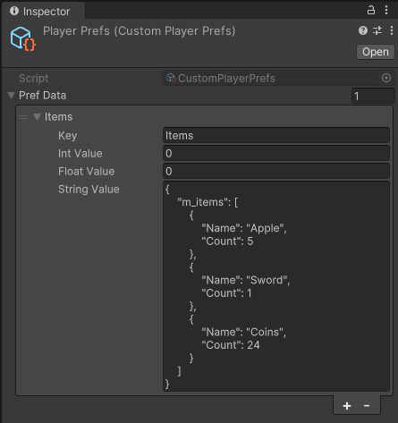

#### How to use

- Firstly, you need to create the Pref ScriptableObjects at `Assets/ScriptableObject/Editor/Prefs` folder. You can find them in the CreatMenu `Prefs>EditorPrefs` and `Prefs>PlayerPrefs`.
- Now you can basically save your prefs to **CustomPlayerPrefs.Instance** or **CustomEditorPrefs.Instance**.

---------------------------------------------------------------------------------------
#### Features

- **ScriptableObjects** does not keep their states between sessions outside of Editor so **CustomPlayerPrefs** falls back to **UnityPlayerPrefs** outside of Editor. **CustomPlayerPrefs** class is there for easy debugging purposes only.

---------------------------------------------------------------------------------------
#### Screenshots
